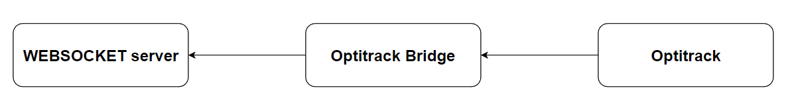
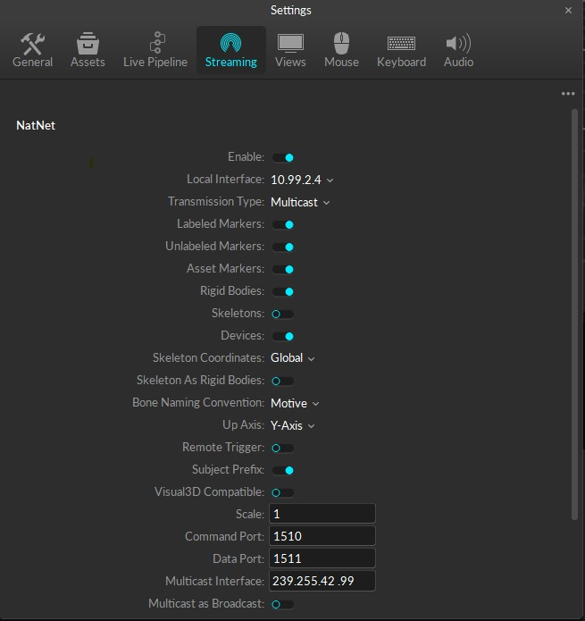

# Optitrack Bridge
This repository has been developed as part of the project *"Mixed Reality Environment For Harvesting Study"* done by Alessandro Dalbesio.

## Getting started
The code in this repository implements a bridge between the optitrack system and a websocket server. <br>
This is a modified version of the NatNet SDK for Python (more information can be found in the <b>Third party libraries</b> section). <br><br>
The schema of the Optitrack Bridge is: <br>


## Installation
You can install this repository in any device connected to the same network/s of the OptiTrack system and the Websocket Server. <br>
The OptiTrack is behind a VPN (ZeroTier) and so you should connect to it before being able to stream the data from it. <br><br>
To install the repository you need to:
1. Clone it
```bash
git clone https://gitlab.epfl.ch/create-lab/sensing-with-vr/optitrack-interface
```
2. (optional) Create a virtual environment for Python in the optitrack folder and activate it
```bash
python3 -m venv venv
source venv/bin/activate # Linux
venv\Scripts\activate # Windows
```
3. Install the requirements
```
pip install -r requirements.txt
```
Before running the <code>main.py</code> file it's important that you verify that:
- You are in the same network of the Optitrack system which you want to stream informations from (currently you can do this with ZeroTier VPN).
- On the Optitrack system the streaming of data is turned on (you can find a screenshot of the configuration in the <b>Motive server configuration</b> section)
- You have set up the parameters in the <code>modules/settings.py</code> file (such as the client address, the server addres, ...)
- The websocket server is up and running. If the websocket is turned off the bridge will start but it will turn off very shortly. If the connection between the websocket server and the OptiTrack bridge is lost the bridge will try to reconnect to the websocket server. The number of reconnection attempts is set in the <code>modules/settings.py</code> file.

Please take into account that in some cases it might take few second before starting streaming the data to the Websocket Server. <br>
<b>IMPORTANT</b>: Please be sure to have all other VPN disconnected since they might interfere and the OptiTrack system might not be able to stream the data to the bridge.

If you are running the program with a manager (e.g. <code>supervisor</code>) is suggested to set the variable <code>LOGGING_ON_STDOUT</code> in the file <code>settings.py</code> to <code>False</code> while is recomended to put it to <code>True</code> if you are running it in a command windows. <br>
The logging on the stdout (controller with the variable <code>LOGGING_ON_STDOUT</code>) is set to a logging level of **DEBUG** while the logging on the file is set to a logging level of **INFO**. <br>

## Modify the code
In this case the code has been adapted to send only few specific data. 
- If you wish to send different type of data (e.g. skeleton, cameras info, ...) you should modify the function <code>__unpack_mocap_data(...)</code> of the class <code>NatNetClient</code> (and in particular the sub-function <code>makeDataReadyForWebsocket(data)</code>) which is in the file <code>NatNetClient.py</code>.
- The bridge apply a filter on the input data and send only the informations relative to specific rigid bodies to the websocket server. <br>
If you wish to remove this filter or you wish to modify the filtered rigidbody please modify the <code>settings.py</code> file.

## Motive server configuration
Below you can find the screenshoot of the a sample NatNet server configuration on Motive. <br>


## Third party libraries
The only third party library that is used in the code (other than the modules in <code>requirements.txt</code>) is [NatNet SDK for Python v.4.0.0](https://optitrack.com/support/downloads/developer-tools.html).

## Contributing
If you modify anything in this repository or in the code please remember to update the <code>requirements.txt</code> file and the <code>README.md</code> file.

## Authors
This repository is part of the project *"Mixed Reality Environment For Harvesting Study"* done by Alessandro Dalbesio.<br>
The project has been done in the CREATE LAB (EPFL).<br>
Professor: Josie Hughes<br>
Supervisor: Ilic Stefan<br>

## License
This project is under [MIT] license